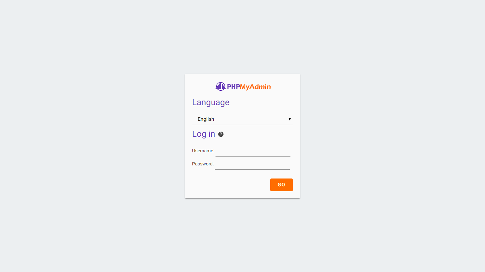
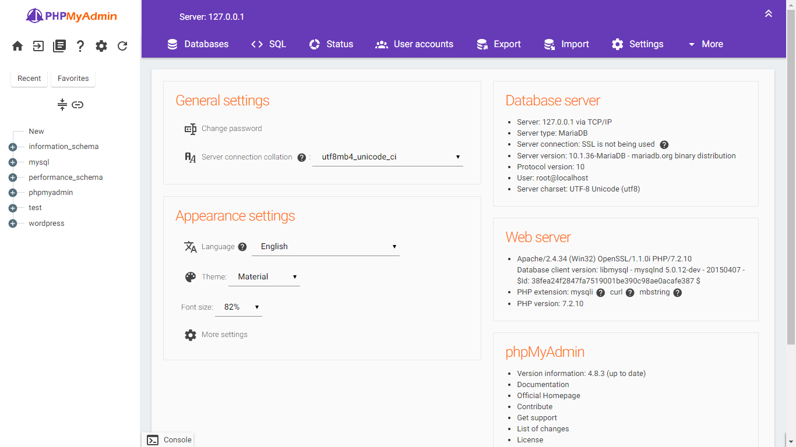
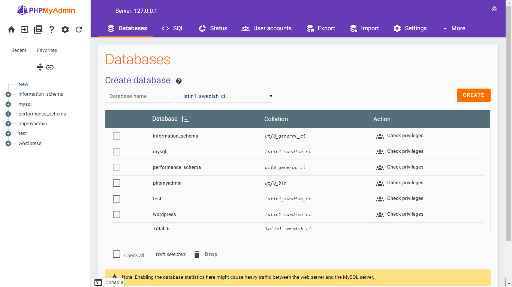
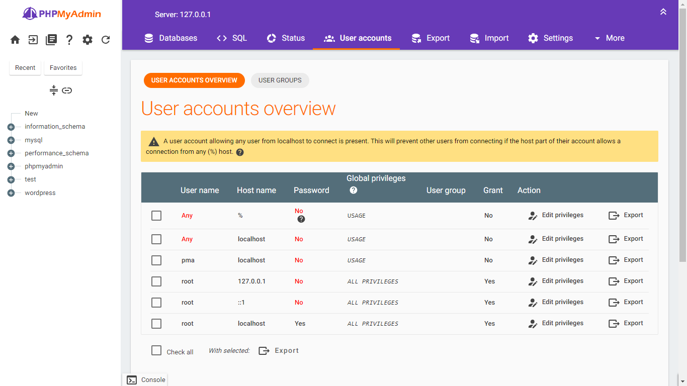
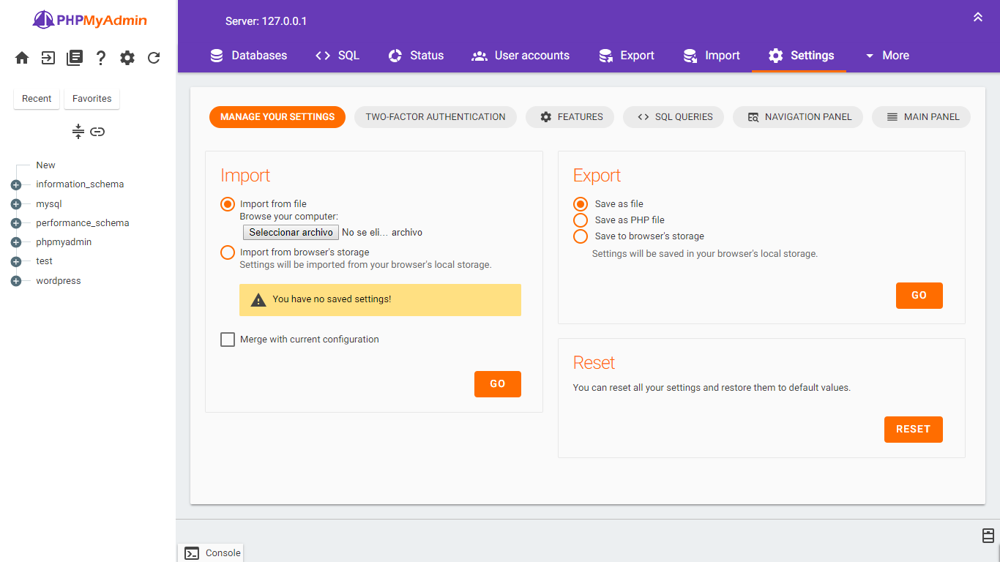
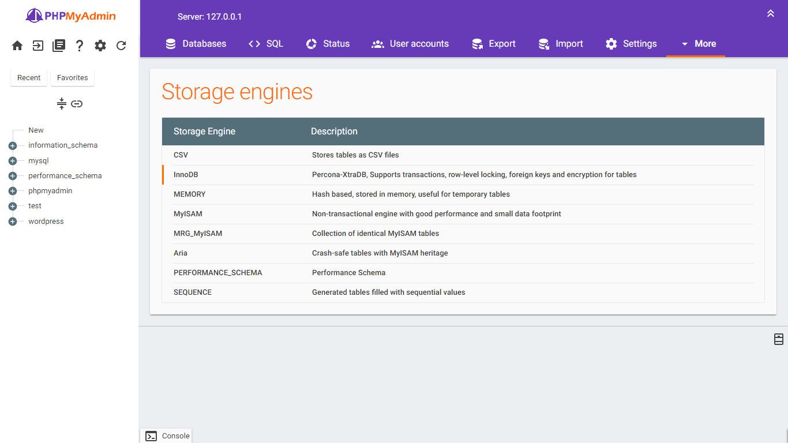

# Material (Work in progress)
Theme material design for phpmyadmin inspire per the [design by Agustin](http://www.materialup.com/posts/phpmyadmin-material-design) and based on [Materialized by Florian](https://github.com/foxdog05000/materialized)

## Usage

* Download Material.
* Unzip **Material-master**.
* Rename **Material-master** to **Material**.
* Move to your phpMyAdmin themes directory.
* Activate "Material" from phpMyAdmin dashboard.
* Done.

## Screenshot

## LICENSE

Licensed under GPL license. Please see the license file: https://github.com/alextorressk/Material/LICENSE
